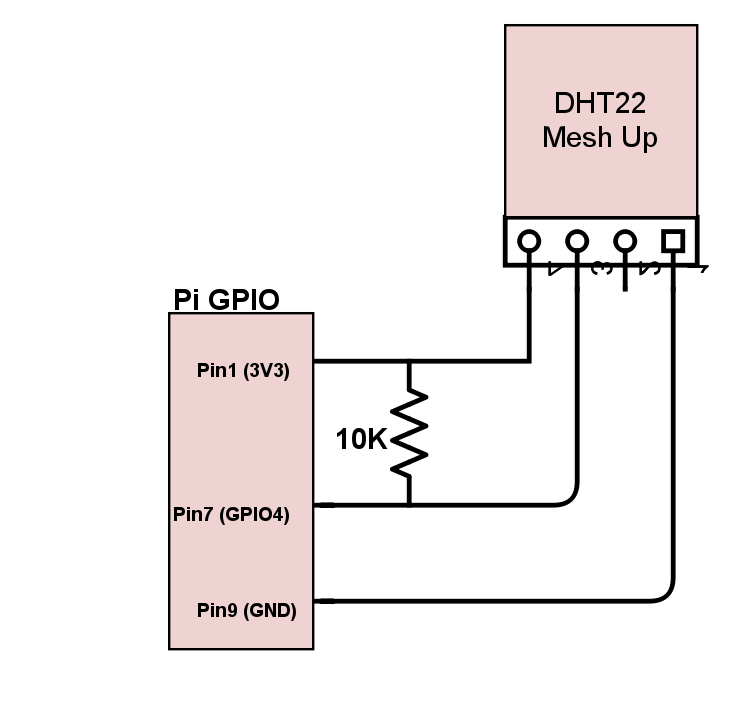

The DHT family of sensors, in the context of reading with a Pi, are NOT 'one-wire' installs. Ignore any old information if your using newer kernels/Raspian. There is a library you need and use with a Python script. 
https://github.com/adafruit/Adafruit_Python_DHT

The NRPE command script is included, check_DHT.py

This was enough to use the sensor as intended. Current state of humidity checking is if it get's to high, this is also acting like a poormans water indicator. 

Add this to your Pi nrpe.cfg

----
command[check_DHT_temp]=sudo /usr/local/nagios/libexec/check_DHT.py -s 22 -p 4 -t temp -w 30 -c 40
command[check_DHT_humid]=sudo /usr/local/nagios/libexec/check_DHT.py -s 22 -p 4 -t humid -w 70 -c 90
----

